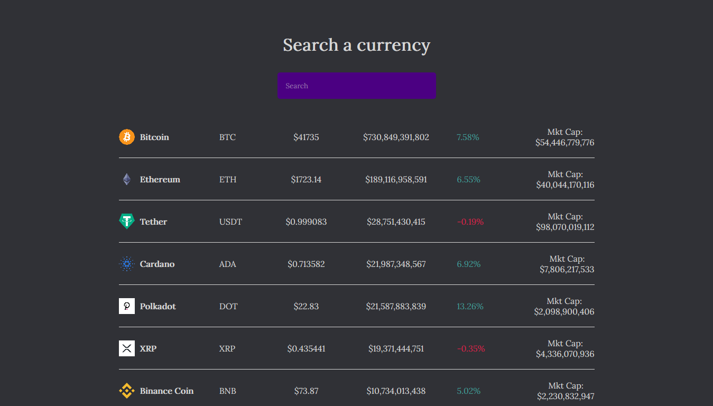
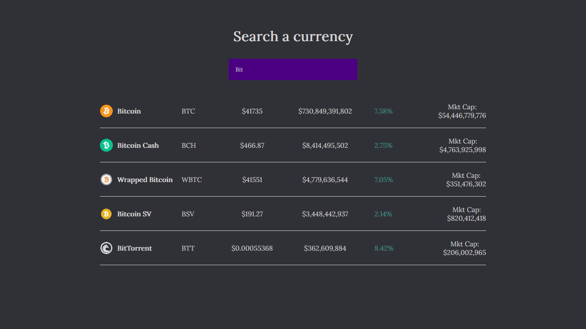

# ReactJS - Crypto-Finance-Tracker 🧑🏽‍💻

```sh 
Current project status: Completed. ✅  
```

This is an exercise react application to display and search on Cryptocurrency with an API:
  - Axios
  - CoinGecko API
  - Hooks

# ~ Code Example: 👨🏿‍💻 

As an example of the project, Axios JS (a popular, promise-based HTTP client that sports an easy-to-use API and can be used in both the browser and Node) was used to retrieve data from the CoinGecko API and filter through it:

```sh
const url = "https://api.coingecko.com/api/v3/coins/markets?vs_currency=usd&order=market_cap_desc&per_page=100&page=1&sparkline=false";

const [coins, setCoins] = useState([]);
const [search, setSearch] = useState("");

// Retrieving data from the API
useEffect(() => {
    axios
    .get(url)
    .then((res) => {
        setCoins(res.data);
    })
    .catch((err) => console.log(err));
}, []);

// Setting the input as search term
const searchCoin = (e) => {
    setSearch(e.target.value);
};

// Filtering method
const filterCoins = coins.filter((coin) =>
    coin.name.toLowerCase().includes(search.toLowerCase())
);
```

After mapping this data to the `coins` state array and passing it as props to the Coin component, a limited amount of coins is rendered dynamically to the main Board component.

# ~ Project Previews: 🖼️ 

Main App |  Searching |
|:-----------:|:-----------:|
 |  |